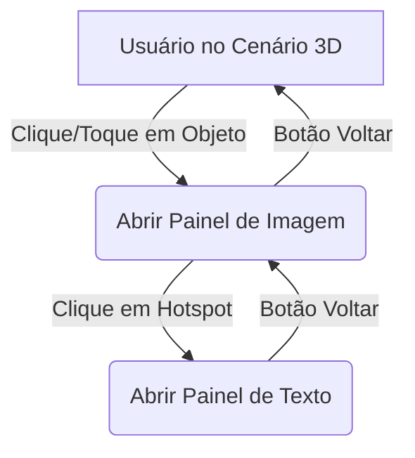

# Arquitetura do Projeto: Gabinete Virtual A-Frame

Este documento descreve a estrutura técnica e as decisões arquiteturais para o ambiente virtual imersivo.

## 🏛️ Visão Geral
O projeto é um ambiente 3D baseado na web com arquitetura **Strictly Modular**. Cada entidade da cena é tratada como um módulo independente, regido por eventos e injeção de configurações, garantindo que o MVP seja o alicerce para uma plataforma escalável.

### Pilares Técnicos e Padrões de Código
- **Core:** [A-Frame 1.4.2](https://aframe.io/)
- **Zero Magic Numbers:** Configurações centralizadas em objetos de constantes.
- **Component-Based Architecture:** Uso extensivo de *Systems* para lógica global e *Components* para comportamentos de entidades.
- **Interação:** Sistema de Raycasting híbrido desacoplado.
- **Hardware Adaptive:** Configurações de renderização via `hardware-profiler`.
- **Developer Experience (DX):** Processos baseados em Node.js (Vite, ESLint, Sharp) para garantir validação de esquema (`JSDoc`), empacotamento (`Bundling`) rápido e segurança na sintaxe, operando localmente sem afetar a PWA vanilla.

---

## 🛠️ Componentes do Sistema

### 1. Stack Manager (`js/navigation.js`)
Responsável por:
- Gerenciar a pilha de navegação (History Stack) e a lógica de retrocesso.
- Emitir `EVENTS.VIEW_CHANGED` ao alterar o topo da pilha, delegando a transição visual ao `view-controller.js`.
- Integrar com `kiosk-mode.js` para log de interações.

### 2. Joystick Mobile (`js/joystick.js`)
Joystick virtual ativado **apenas em dispositivos touch**. Detecta a presença de toque via `'ontouchstart' in window` e, ao encontrar os elementos `#mobile-joystick-zone` e `#mobile-joystick-knob` no DOM:
- Traduz arrastar do polegar em direções normalizadas (-1 a 1).
- Emite eventos sintéticos `KeyboardEvent` (`KeyW`/`KeyA`/`KeyS`/`KeyD`) para o `wasd-controls` do A-Frame, sem acoplamento direto ao motor de física.
- Possui zona morta central (threshold: 0.3) para evitar deriva acidental.

### 3. Interaction System (Híbrido)
Configurado para funcionar em dispositivos Android (Touch) e Desktop:
- **Raycast on Demand:** Raycaster não-contínuo. Para economizar CPU, o raycaster calcula interseções *apenas* em `click` ou `touchend`.
- **Silent Mode (Modo Silencioso):** Objetos interativos que *não* possuem conteúdo multimídia (ex: portas, gavetas decorativas) não afetam a Pilha de Navegação (Navigation Stack). Ao clicar, disparam animações locais puras sem travar a interface do usuário ou causar bugs de "clique em vazio".
- **Hidden Admin Gesture:** Layer DOM transparente (`z-index: 10000`) ativado apenas na região sensível (canto inferior esquerdo, 15vw × 15vh) para não bloquear a cena 3D. Após **3 toques rápidos** (intervalo < 500ms), o sistema executa `location.replace('adm.html')` — sem entrada no histórico do navegador, impedindo bypass via botão Voltar. A validação de PIN, rate-limiting e lockout ficam inteiramente em `adm.html` via `js/pin-overlay.js`.
- **X-Ray Visual Debugger (`?debug=1`):** Ativa um depurador de colisão de alta performance via `window.GABINETE_DEBUG`. As caixas de colisão reagem visualmente via acesso direto ao `mesh.material.color.setHex()` do Three.js: Hover (Verde `#00ff00`), Clique (Ciano `#00ffff`) e Colisão Física de Avatar (Amarelo `#ffff00`).

### 4. Motor de Física (Character Controller 3D)
O sistema não depende de engines físicas pesadas (como Cannon/Ammo). O `physics.js` é um módulo ES6 ultraleve focado exclusivamente em caminhada e barreira de contenção:
- **OBB (Oriented Bounding Box):** Diferente de colisões esféricas comuns que consideram apenas o raio máximo, o Gabinete usa conversão matemática de matrizes (`worldToLocal`) para calcular interseções precisas em OBB, respeitando perfeitamente a Escala (X/Z) e Rotação de paredes extremamente finas.
- **Cilindro 3D com Respeito Vertical (Y-Axis Lock):** O avatar do jogador atua como um cilindro de 1.7 metros (Pés: -1.5m, Cabeça: +0.2m da câmera). Caixas de colisão planas (como tapetes) ou lustres de teto são fisicamente ignoradas para o "empurrão lateral", impedindo arremessos falsos. Proteção Anti-NaN ("Buraco Negro") protege o loop em caso de singularidade (nascimento em 0,0 exato).
- **Pulo e Agachamento (Reservado para uso futuro):** A lógica de pulo (`jumpForce: 4.5`, `gravity: -12.0`) e agachamento (crouchHeight = baseHeight/2) está implementada no `physics.js` porém **comentada no MVP**. O bloco pode ser reativado removendo o comentário em `physics.js` e habilitando os controles de teclado (`Control/Espaço` para pulo, `Alt/C` para agachamento).

### 5. Painéis de Detalhe (Overlays HTML)
- **Implementação Atual:** Overlay HTML/CSS 2D projetado sobre a cena 3D via `spatial-tracker.js`. Fundo escuro. Glassmorphism reservado como *Progressive Enhancement*.

---

## 🔄 Fluxo de Dados e Interação



### 4.1. Event Bus Centralizado
Toda comunicação entre o cenário 3D, Interface de UI e Segurança *Kiosk* não deve ser feita através de `strings` literais perdidas pelo código. O sistema utilizará um **Catalisador Estrito de Eventos** (ex: `js/events.js` com dicionários congelados) para garantir que todos os `emit` e `addEventListener` sejam rastreáveis e à prova de erros de digitação.

---

## 📱 Otimização para Hardware Sem GPU (Software Rendering)

Dispositivos como Tablets de 4GB RAM e Desktops i3 antigos utilizam **SwiftShader** ou **llvmpipe**. A carga de renderização cai inteiramente na CPU.

### 6.1. Renderer Flags (A-Frame 1.4.2)
Aplicaremos estas configurações via `hardware-profiler` ao detectar falta de GPU:
- `precision: lowp` (Reduz custo de cálculos matemáticos no shader).
- `antialias: false` (Desativa MSAA, economizando largura de banda).
- `alpha: false` (Evita blending desnecessário).
- `stencil: false` / `depth: true`.
- **Adaptive Quality (DPI):** Monitora o FPS em tempo real. Se cair abaixo de 30FPS por 10 segundos, reduz o `devicePixelRatio`.

### 6.2. Gestão de Memória (RAM)
- **Deep WebGL Disposal:** Ao desconectar UI 3D ou trocar grandes elementos visuais decorrentes de navegação no painel de interações, certificar a remoção atrelada limpando caches do próprio WebGL através de `.dispose()` na geometria, no material e na textura original do item desmontado para cortar risco real de memory leaks no *Kiosk Mode*.
- **PWA Resource Sharding:** O Service Worker prioriza o carregamento de ativos `low-res` (1024px) por padrão para dispositivos sem GPU identificado no `UserAgent`.

---

## 🎨 Design System (Aesthetics)

### 6.1. Design Tokens (CSS Variables)
```css
:root {
  --primary: #00D1FF;       /* Ciano Premium */
  --accent: #FF6B00;        /* Laranja de destaque */
  --bg-main: #000000;
  --bg-alt: #121212;
  --glass-bg: rgba(255, 255, 255, 0.1);
  --glass-border: rgba(255, 255, 255, 0.2);
  --glass-blur: blur(12px);  /* Reservado para Progressive Enhancement */
  --text-main: #FFFFFF;
  --font-titles: 'Outfit', sans-serif;
  --font-body: 'Inter', sans-serif;
}
```

- **Tipografia:** Uso de fontes SDF do A-Frame. Padrão: **Inter** (Textos) e **Outfit** (Títulos).
- **Splash Screen (UI-Boot):** Camada HTML/CSS externa que bloqueia o acesso à cena até que `renderer` e `assets` básicos estejam prontos. Inclui barra de progresso estilizada.
- **Multilíngue (i18n):** O `I18nHandler` (`js/i18n.js`) injeta as strings via atributos `data-i18n` (DOM) e `data-i18n-aframe` (A-Frame) durante o ciclo de vida.
---

## 7. Gestão de Ativos e Pendências

> [!WARNING]
> Os seguintes componentes são considerados **"Placeholders"** ou **"Em Definição"** no estado atual do projeto:
> - **Iluminação:** Atualmente o ambiente utiliza uma luz ambiente (`ambient`) e uma luz direcional (`directional`) básica. O esquema real (sombras, pontos de luz específicos) depende da definição do conceito artístico. Veja a tabela abaixo para opções de teste.
> - **Texturas/Materiais:** As imagens dos painéis e dos objetos interativos ainda não foram fornecidas. O sistema está preparado para receber caminhos de arquivos PNG/JPG/WebP.
> - **Modelos 3D:** O cenário atual utiliza primitivas (`a-box`, `a-plane`). A integração de arquivos GLB/GLTF ocorrerá em fases posteriores quando os modelos forem selecionados ou criados.

### 7.1. Opções de Iluminação Artística (Para Testes)

Utilizaremos esta tabela como guia para os testes de atmosfera no ambiente:

| Tipo (`light type`) | Comportamento Visual | Efeito Artístico | Impacto Android |
| :--- | :--- | :--- | :--- |
| **Ambient** | Ilumina todos os objetos igualmente, sem direção ou sombras. | Preenchimento básico; evita áreas pretas absolutas. | 🟢 Baixíssimo |
| **Directional** | Luz paralela (como o Sol). Projeta sombras paralelas. | Define formas e profundidade; ideal para ambientes externos. | 🟡 Médio (conforme sombras) |
| **Hemisphere** | Gradiente entre duas cores (Céu e Chão). | Simula luz natural rebatida; adiciona realismo sem sombras pesadas. | 🟢 Baixo |
| **Point** | Luz que emana de um ponto em todas as direções (Lâmpada). | Cria focos dramáticos e realça objetos específicos. | 🔴 Alto (muitas luzes pesam) |
| **Spot** | Cone de luz focalizado. Projeta sombras em formato de cone. | Efeito de "palco" ou lanterna; foca a atenção do usuário. | 🔴 Alto (sombras complexas) |

### 7.2. Global Asset Fallback Strategy
Para garantir a Regra Pétrea 6 da Spec Técnica:
- **Modelos (.glb):** Em caso de `model-error`, renderizar um `a-box` com material `wireframe: true; color: #FF6B00`.
- **Texturas (.jpg/.png):** Em caso de erro de carregamento, aplicar uma textura de ruído cinza ou cor sólida neutra com ícone de interrogação.

---

## 8. Arquitetura Offline-First (PWA)

Para garantir que o aplicativo funcione 100% sem internet (em ambientes isolados ou museus, por exemplo), adotaremos a seguinte estratégia:

### 8.1. Localização de Dependências
- **A-Frame:** Carregado localmente em `js/vendor/aframe.min.js` (offline-first). Versão de referência da instalação: **1.4.2** — para confirmar a versão exata do bundle em uso, inspecione o arquivo localmente ou verifique o `package.json` do projeto A-Frame gerador.
- **Fontes:** Atualmente carregadas via Google Fonts CDN (`@import url(...)` no CSS). A localização para arquivos `.json` e `.png` (SDF fonts) é recomendada para deploy final offline absoluto.
- **Service Worker (`sw.js`):** Gerencia o cache de rede e permite que o app seja instalado no Android/Desktop via PWA. Estratégia atual: `CacheFirst` para assets estáticos e assets do Supabase Storage.

### 8.2. Distribuição e Uso Offline
Existem duas formas principais de levar o app para o ambiente sem internet:

1. **Método PWA (Recomendado para GitHub Pages):**
   - O usuário acessa a URL uma única vez com internet.
   - O navegador baixa e "instala" o app (Service Worker).
   - A partir daí, o app funciona como um aplicativo nativo, abrindo pelo ícone na tela inicial mesmo sem sinal.
   
2. **Método Sideloading (Cópia via USB):**
   - O projeto é baixado como um arquivo `.zip` contendo tudo (HTML, JS, Assets).
   - No **Desktop**, basta abrir o `index.html`.
   - No **Android**, devido a restrições de segurança do navegador (`CORS`), abrir o arquivo direto da pasta (`file://`) pode bloquear as texturas. Para isso, recomendamos o uso de um "Web Server" simples para Android (como o app *Tiny Web Server*) para servir a pasta localmente.

### 8.3. Implementações Futuras do PWA

> [!NOTE]
> As seguintes otimizações de Service Worker estão mapeadas para fases pós-MVP e **não estão implementadas** atualmente:

| Funcionalidade | Descrição | Motivo do Adiamento |
|---------------|-----------|--------------------|
| **PWA Resource Sharding** | SW detecta ausência de GPU via `UserAgent` e prioriza carga de assets `_low` (512px) sobre `_high` (1024px) | Requer padronização do pipeline de assets `_low`/`_high` primeiro |
| **Fontes SDF Locais** | Mover fontes Inter/Outfit do Google Fonts CDN para arquivos `.json`+`.png` locais | Depende de geração dos arquivos SDF com `msdf-bmfont-xml` |
| **Cache Parcial por Rota** | Estratégia `NetworkFirst` para `config.json` e `StaleWhileRevalidate` para assets de galeria | Baixo impacto no MVP atual com sync via GitHub API |
| **Background Sync API** | Enfileirar operações de upload offline e enviar quando reconectar, usando a Background Sync API nativa do browser | Requer investigação de suporte em Android WebView do Fully Kiosk |

### 8.4. Portabilidade Total
O código é escrito de forma **100% Relativa** (base: `./` no `vite.config.js`). Não utilizamos barras iniciais (`/js/...`) ou caminhos absolutos. Todo o projeto pode ser movido de pasta ou domínio sem quebrar, facilitando o deploy offline e a cópia para dispositivos via USB.

---

## 9. Modo Quiosque (Uso em Museus)

Para atender às necessidades de uma exposição permanente, o sistema contará com comportamentos específicos de "auto-gestão":

### 9.1. Persistência do Aplicativo
- **Armazenamento Permanente:** Uma vez "instalado" (PWA) ou copiado para a memória do dispositivo Android/Desktop, os arquivos **não precisam ser baixados novamente**. O navegador mantém o cache local até que seja limpo manualmente.
- **Funcionamento Diário:** No início de cada dia, basta abrir o app. Ele carregará instantaneamente a partir dos arquivos locais, sem depender de conexão externa.

### 9.2. Registro de Interações (Zero-Admin)
Como o ambiente não terá administração constante:
- **Persistência por Evento:** O sistema grava cada interação do usuário no **`LocalStorage`** imediatamente ao ocorrer (a cada clique, navegação ou reset de sessão) via `kiosk.logEvent()`. Diferente de uma sessão temporária, esses dados sobrevivem ao desligamento forçado do tablet.
- **Segurança de Dados:** Ao ligar o tablet no dia seguinte, os dados do dia anterior continuam salvos internamente no navegador, acumulando estatísticas até que um responsável realize a exportação manual via `adm.html`.

### 9.3. Interface de Gestão de Logs (`adm.html`)
O painel administrativo (`adm.html`) possui uma seção dedicada **"Logs de Interação"** com as seguintes ações:
- **Visualizador JSON:** Botão **Atualizar Logs** (`updateLogs()`) renderiza o conteúdo de `LocalStorage[LOG_KEY]` em um `<pre>` formatado com `JSON.stringify`, em ordem cronológica reversa.
- **Exportação CSV:** Botão **Exportar CSV** (`exportLogsCSV()`) serializa os logs em formato CSV e dispara download automático no navegador.
- **Limpeza:** Botão **Limpar Tudo** (`clearLogs()`) remove a chave `LOG_KEY` do `LocalStorage` após confirmação via `window.confirm`.

### 9.4. Inicialização Automática (Auto-Start)
Para garantir que o app abra assim que o dispositivo for ligado:
- **No Android:** Recomendamos a utilização de um app de **"Kiosk Mode"** (como o *Fully Kiosk Browser*). Ele permite configurar uma URL de início, bloqueia outras funções do tablet e garante que o navegador abra automaticamente no boot.
- **No Desktop (Windows):** Criaremos um atalho do navegador (Chrome/Edge) em modo `--kiosk` e o colocaremos na pasta `Inicializar` do Windows.

---

## 10. Developer Experience (DX) & Pipeline Automatizado

Para viabilizar a prototipação rápida e não comprometer o cronograma nem a segurança na hora de lidar com as Regras Pétreas, a base de desenvolvimento utilizará um ecossistema Node.js local.

### 10.1. Vite como Motor de Dev & Build
Apesar de o core do MVP rodar com Vanilla JS/HTML/CSS (sem compilação de frameworks frontend pesados), desenvolveremos rodando um servidor local via **Vite**. 
- **Rapidez (HMR):** O vite permite injeção de estilo e lógica em milissegundos sem recarregar e reposicionar o ponto de vista da câmera no 3D.
- **PWA Ready:** Durante o Build final, o Vite cuidará de empacotar de forma estrita, limpar arquivos não utilizados e re-adequar os "caminhos relativos" transparentemente.

### 10.2. JSDoc Type Checking e Linhas-Guia
Aplicaremos a anotação padrão `// @ts-check` nativa no topo dos arquivos centrais (`navigation.js`, `kiosk-mode.js` e ao realizar o parse do `config.json`). O editor alertará imediatamente em vermelho qualquer desvio de contrato funcional antes da execução. As declarações de tipo estão centralizadas em `js/types.d.ts`.

### 10.3. Pipeline de Assets Node (Acelerador de Cronograma)
Como a arquitetura demanda versões leves de textura, a criação visual disso não será manual. Utilizaremos um `Asset Pipeline` local via `npm run optimize-assets`:
- **Entrada/Saída:** Ambas em `assets/images/` — o script processa arquivos com prefixo `02_` (PNG/JPG) e gera as versões WebP no mesmo diretório.
- **Variante `_high`:** 1024×1024px máximo (`fit: inside`), qualidade WebP 80%, sufixo `_high.webp`.
- **Variante `_low`:** 512×512px máximo, qualidade WebP 60%, sufixo `_low.webp` — usada pelo Hardware Profiler em dispositivos sem GPU.

---

## 11. Sistema de Curadoria e Gestão de Acervo

Interface de gestão que permite a um curador gerenciar obras sem depender do programador.

### 11.1. Módulos

| Módulo | Arquivo | Função |
|--------|---------|--------|
| Secrets Loader | `js/secrets-loader.js` | Credenciais AES-256-GCM, auto-clear de memória |
| Hash Engine | `js/hash-engine.js` | SHA-256 via Web Crypto API + fallback FNV-1a |
| Manifest Manager | `js/manifest.js` | CRUD do manifesto de hashes |
| Image Pipeline | `js/image-pipeline.js` | Conversão WebP (`_high` q85% + `_low` 512px q60%) |
| Supabase Client | `js/supabase-client.js` | Upload via Edge Function `asset-manager` (service_role server-side); download/list com anon key |
| Sync Engine | `js/sync-engine.js` | Orquestrador offline-first — leitura **e escrita direta** na GitHub API usando `GITHUB_TOKEN` criptografado no `secrets.json`. Não utiliza Edge Function intermediária. |
| PIN Overlay | `js/pin-overlay.js` | Overlay de PIN reutilizável (DRY entre adm.html e curadoria) com suporte nativo a form submit |
| Curadoria App | `js/curadoria-app.js` | UI de curadoria (CRUD obras + upload de assets) |

### 11.2. Segurança de Credenciais

**Stack:** WebCrypto API (PBKDF2/AES-256-GCM)

| Camada | Implementação |
|--------|--------------|
| **Armazenamento** | `secrets.json` criptografado com AES-256-GCM |
| **Chave** | Derivada do `ADMIN_PIN` via PBKDF2 (200.000 iterações, SHA-256) |
| **Acesso Admin** | Gesto 3x no kiosk → `adm.html` via `showPinOverlay()` de `js/pin-overlay.js` |
| **Rate Limiting** | 3 tentativas → lockout de 30s (configurável em `config.js`) |
| **Memória** | Credenciais vivem apenas em `_cache` (módulo JS) |
| **Auto-clear** | Timeout de 30min (`SECRETS_TIMEOUT_MS`) + `visibilitychange` **condicional** (só limpa se timer já expirou, preservando troca de abas ativa) |
| **Troca de PIN** | Re-criptografa automaticamente via `/api/save-secrets` (Vite) |
| **Produção & Dev** | Fallback Híbrido: mescla conteúdo decriptado com variáveis `import.meta.env` (injetadas via `.env.local` ou CI/CD GitHub) |

**Fluxo de autenticação:**
```
Usuário → 3x canto kiosk → adm.html
  → PIN overlay (rate-limited) → AES-GCM decrypt
  → _cache em memória → timer 30min → clearSecrets()
```

### 11.3. Supabase Storage

- **Bucket:** `gabinete-assets` (público — leitura livre sem autenticação via URL pública; RLS bypassed para SELECT em buckets públicos do Supabase)
- **Escrita:** Via Edge Function `asset-manager` — `service_role` key permanece server-side no Supabase, nunca exposta ao browser
- **Leitura/Lista:** `anon` key (segura para GitHub Pages)
- **Delete:** Via Edge Function `asset-manager` (DELETE method)
- **Tipos:** WebP (imagens convertidas) + GLB (modelos 3D)
- **URLs:** Salvas no `config.json` — kiosk carrega diretamente da CDN Supabase

---

## 12. Sincronização Híbrida (Offline-First)

| Camada | Tecnologia | Dados | Limite |
|--------|-----------|-------|--------|
| **Config** | GitHub API | `config.json` (obras, metadados) | Ilimitado |
| **Assets** | Supabase Storage | WebP, GLB | 1GB grátis |
| **Hash** | Web Crypto SHA-256 | Manifesto de integridade | — |
| **Cache local** | Service Worker | Todos os assets para offline | — |

**Resolução de conflitos:** Timestamp wins — versão mais recente vence no boot.
**Prevenção de Falsos Offline:** Checagem de conectividade usa `mode: 'no-cors'` para validar roteamento sem ser bloqueado por restrições CORS.

**Deploy CI/CD:** GitHub Actions (`.github/workflows/deploy.yml`)
- Push em `main` → build Vite → GitHub Pages
- Variáveis de ambiente: `VITE_SUPABASE_URL`, `VITE_SUPABASE_ANON_KEY` (somente leitura)
- `secrets.json` e `service_role` key nunca sobem para o repositório
